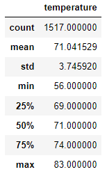

# Surfs_up

## I. Overview of Project

### Background
In order to get the backing of an investor, W. Avy, the temperature trends of Oahu for the last 12 months were analayzed and presented.

### Objective
In addition, he is requesting specific data for the months of June and December, in order to determine if the surf and ice cream shop business is sustainable year-round.

## II. [Analysis and Results](SurfsUp_Challenge.ipynb)

### A. Summary Statistics for June

**JUNE: MIN=64.0  MAX=85.0  AVE=74.9**

### B. Summary Statistics for December

**DECEMBER: MIN=56.0  MAX=83.0  AVE=71.0**

There is a bulleted list that addresses the three key differences in weather between June and December. (6 pt)

## III. Summary

There is a high-level summary of the results and there are two additional queries to perform to gather more weather data for June and December. (5 pt)
